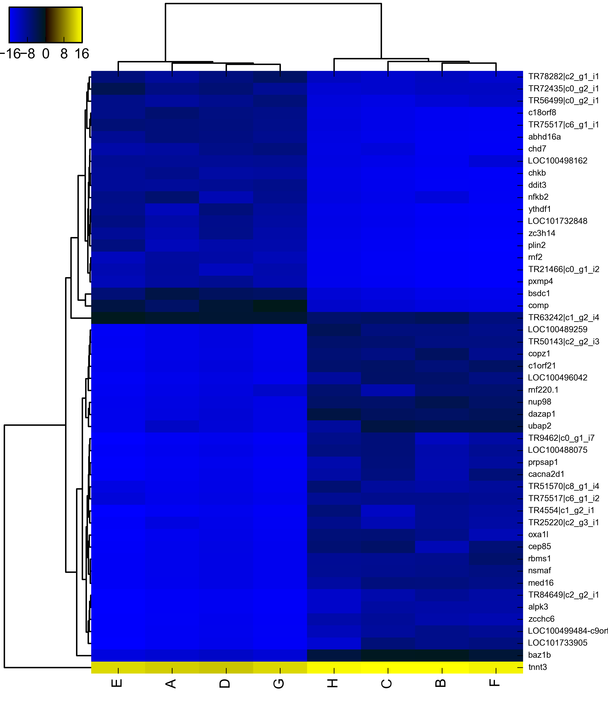

.. notes from the literature

Differential expression analysis
======================================

These results are specific to the :doc:`de novo assembly<de-novo-assembly>`.

Create raw and normalized count matrices
------------------------------------------

The software Sailfish was used to estimate read abundances [Patro14]_.

    * :download:`runSailfish.py <../assembly/runSailfish.py>`
    * :download:`assembleCountMatrices.py <../features/assembleCountMatrices.py>`

Run edgeR and DESeq
----------------------

DESeq2 was run on the assembly for the isoform count matrices [Love14]_.

    * :download:`runDeAnalysis.py <../features/runDeAnalysis.py>`
    * :download:`runDESeq.R <../features/runDESeq.R>`

Then the resulting \*.csv files were summarized using

    * :download:`summarizeResultsDE.py <../features/summarizeResultsDE.py>`

Endurant vs non-endurant summary
-----------------------------------

.. _XP_004911823.1: http://www.ncbi.nlm.nih.gov/gene/?term=XP_004911823.1
.. _Q6DIN9_XENTR: http://www.uniprot.org/uniprot/Q6DIN9_XENTR
.. _XP_004912278.1: http://www.ncbi.nlm.nih.gov/gene/?term=XP_004912278.1
.. _Q08D54_XENTR: http://www.uniprot.org/uniprot/Q08D54_XENTR
.. _XP_002940251.2: http://www.ncbi.nlm.nih.gov/gene/?term=XP_002940251.2
.. _BSDC1_XENTR: http://www.uniprot.org/uniprot/BSDC1_XENTR
.. _A4IHS1_XENTR: http://www.uniprot.org/uniprot/A4IHS1_XENTR
.. _Q6P383_XENTR: http://www.uniprot.org/uniprot/Q6P383_XENTR
.. _B2GUD3_XENTR: http://www.uniprot.org/uniprot/B2GUD3_XENTR
.. _Q28G35_XENTR: http://www.uniprot.org/uniprot/Q28G35_XENTR
.. _XP_002935909.2: http://www.ncbi.nlm.nih.gov/gene/?term=XP_002935909.2
.. _MED16_XENTR: http://www.uniprot.org/uniprot/MED16_XENTR
.. _XP_004919990.1: http://www.ncbi.nlm.nih.gov/gene/?term=XP_004919990.1
.. _Q28E92_XENTR: http://www.uniprot.org/uniprot/Q28E92_XENTR
.. _Q0IIS2_XENTR: http://www.uniprot.org/uniprot/Q0IIS2_XENTR
.. _B0JZE0_XENTR: http://www.uniprot.org/uniprot/B0JZE0_XENTR
.. _XP_002943281.2: http://www.ncbi.nlm.nih.gov/gene/?term=XP_002943281.2
.. _XP_004910374.1: http://www.ncbi.nlm.nih.gov/gene/?term=XP_004910374.1
.. _B0BM63_XENTR: http://www.uniprot.org/uniprot/B0BM63_XENTR
.. _XP_004913877.1: http://www.ncbi.nlm.nih.gov/gene/?term=XP_004913877.1
.. _A7MC69_XENTR: http://www.uniprot.org/uniprot/A7MC69_XENTR
.. _XP_002937491.1: http://www.ncbi.nlm.nih.gov/gene/?term=XP_002937491.1
.. _B1H195_XENTR: http://www.uniprot.org/uniprot/B1H195_XENTR
.. _A1L1E0_XENTR: http://www.uniprot.org/uniprot/A1L1E0_XENTR
.. _XP_004917118.1: http://www.ncbi.nlm.nih.gov/gene/?term=XP_004917118.1
.. _XP_002935025.2: http://www.ncbi.nlm.nih.gov/gene/?term=XP_002935025.2
.. _Q6P1V5_XENTR: http://www.uniprot.org/uniprot/Q6P1V5_XENTR
.. _XP_002936158.2: http://www.ncbi.nlm.nih.gov/gene/?term=XP_002936158.2
.. _Q6P8C3_XENTR: http://www.uniprot.org/uniprot/Q6P8C3_XENTR
.. _XP_002932902.2: http://www.ncbi.nlm.nih.gov/gene/?term=XP_002932902.2
.. _XP_004920656.1: http://www.ncbi.nlm.nih.gov/gene/?term=XP_004920656.1
.. _XP_002934616.2: http://www.ncbi.nlm.nih.gov/gene/?term=XP_002934616.2
.. _Q6DF61_XENTR: http://www.uniprot.org/uniprot/Q6DF61_XENTR
.. _B1WAN7_XENTR: http://www.uniprot.org/uniprot/B1WAN7_XENTR
.. _Q6P8D4_XENTR: http://www.uniprot.org/uniprot/Q6P8D4_XENTR
.. _Q28CJ2_XENTR: http://www.uniprot.org/uniprot/Q28CJ2_XENTR
.. _Q6P7Z5_XENTR: http://www.uniprot.org/uniprot/Q6P7Z5_XENTR

+---------------------+-----------------------+--------------------------+---------------------------------------------------+------------------+------------------+------------------+
| transcript ID       | hitId                 | gene-symbol              | species                                           | e-value          | DESeq-pval       | DESeq-adj-pval   |
+=====================+=======================+==========================+===================================================+==================+==================+==================+
| TR69111|c4_g2_i3    | `XP_004911823.1`_     | baz1b                    | Xenopus  tropicalis                               | 0.0              | 0.0              | 0.0              |
+---------------------+-----------------------+--------------------------+---------------------------------------------------+------------------+------------------+------------------+
| TR9113|c5_g1_i7     | `Q6DIN9_XENTR`_       | dazap1                   | Xenopus  tropicalis                               | 0.0              | 0.0              | 0.0              |
+---------------------+-----------------------+--------------------------+---------------------------------------------------+------------------+------------------+------------------+
| TR66613|c0_g1_i14   | `XP_004912278.1`_     | nup98                    | Xenopus  tropicalis                               | 0.0              | 0.0              | 0.0              |
+---------------------+-----------------------+--------------------------+---------------------------------------------------+------------------+------------------+------------------+
| TR73951|c3_g1_i5    | `Q08D54_XENTR`_       | c1orf21                  | Xenopus  tropicalis                               | 0.0              | 0.0              | 0.0              |
+---------------------+-----------------------+--------------------------+---------------------------------------------------+------------------+------------------+------------------+
| TR86851|c0_g1_i2    | `XP_002940251.2`_     | comp                     | Xenopus  tropicalis                               | 0.0              | 0.0              | 0.0              |
+---------------------+-----------------------+--------------------------+---------------------------------------------------+------------------+------------------+------------------+
| TR38604|c3_g1_i4    | `BSDC1_XENTR`_        | bsdc1                    | Xenopus  tropicalis                               | 0.0              | 0.0              | 0.0              |
+---------------------+-----------------------+--------------------------+---------------------------------------------------+------------------+------------------+------------------+
| TR50143|c2_g2_i3    | -                     | -                        | -                                                 | -                | 0.0              | 0.0              |
+---------------------+-----------------------+--------------------------+---------------------------------------------------+------------------+------------------+------------------+
| TR75517|c6_g1_i1    | -                     | -                        | -                                                 | -                | 0.0              | 0.0              |
+---------------------+-----------------------+--------------------------+---------------------------------------------------+------------------+------------------+------------------+
| TR23367|c1_g1_i5    | `A4IHS1_XENTR`_       | c18orf8                  | Xenopus  tropicalis                               | 0.0              | 0.0              | 0.0              |
+---------------------+-----------------------+--------------------------+---------------------------------------------------+------------------+------------------+------------------+
| TR40138|c1_g1_i3    | `Q6P383_XENTR`_       | copz1                    | Xenopus  tropicalis                               | 0.0              | 0.0              | 0.0              |
+---------------------+-----------------------+--------------------------+---------------------------------------------------+------------------+------------------+------------------+
| TR90687|c10_g1_i2   | `B2GUD3_XENTR`_       | nsmaf                    | Xenopus  tropicalis                               | 0.0              | 0.0              | 0.0              |
+---------------------+-----------------------+--------------------------+---------------------------------------------------+------------------+------------------+------------------+
| TR92816|c5_g1_i8    | `Q28G35_XENTR`_       | abhd16a                  | Xenopus  tropicalis                               | 0.0              | 0.0              | 0.0              |
+---------------------+-----------------------+--------------------------+---------------------------------------------------+------------------+------------------+------------------+
| TR10061|c3_g1_i2    | `XP_002935909.2`_     | LOC100489259             | Xenopus  tropicalis                               | 1.3e-06          | 0.0              | 0.0              |
+---------------------+-----------------------+--------------------------+---------------------------------------------------+------------------+------------------+------------------+
| TR92341|c0_g1_i7    | `MED16_XENTR`_        | med16                    | Xenopus  tropicalis                               | 0.0              | 0.0              | 0.0              |
+---------------------+-----------------------+--------------------------+---------------------------------------------------+------------------+------------------+------------------+
| TR48389|c5_g2_i8    | `XP_004919990.1`_     | LOC100496042             | Xenopus  tropicalis                               | 0.0              | 0.0              | 0.0              |
+---------------------+-----------------------+--------------------------+---------------------------------------------------+------------------+------------------+------------------+
| TR63133|c6_g1_i6    | `Q28E92_XENTR`_       | ddit3                    | Xenopus  tropicalis                               | 0.0              | 0.0              | 1e-07            |
+---------------------+-----------------------+--------------------------+---------------------------------------------------+------------------+------------------+------------------+
| TR61919|c3_g1_i12   | `Q0IIS2_XENTR`_       | rbms1                    | Xenopus  tropicalis                               | 0.0              | 0.0              | 1e-07            |
+---------------------+-----------------------+--------------------------+---------------------------------------------------+------------------+------------------+------------------+
| TR62059|c0_g1_i8    | `B0JZE0_XENTR`_       | chkb                     | Xenopus  tropicalis                               | 0.0              | 0.0              | 1.1e-06          |
+---------------------+-----------------------+--------------------------+---------------------------------------------------+------------------+------------------+------------------+
| TR75517|c6_g1_i2    | -                     | -                        | -                                                 | -                | 0.0              | 1.6e-06          |
+---------------------+-----------------------+--------------------------+---------------------------------------------------+------------------+------------------+------------------+
| TR89977|c2_g1_i4    | `XP_002943281.2`_     | LOC100488075             | Xenopus  tropicalis                               | 0.0              | 0.0              | 2.5e-06          |
+---------------------+-----------------------+--------------------------+---------------------------------------------------+------------------+------------------+------------------+
| TR25070|c2_g2_i2    | `XP_004910374.1`_     | ubap2                    | Xenopus  tropicalis                               | 0.0              | 0.0              | 2.9e-06          |
+---------------------+-----------------------+--------------------------+---------------------------------------------------+------------------+------------------+------------------+
| TR47339|c2_g1_i1    | `B0BM63_XENTR`_       | cep85                    | Xenopus  tropicalis                               | 0.0              | 0.0              | 3.2e-06          |
+---------------------+-----------------------+--------------------------+---------------------------------------------------+------------------+------------------+------------------+
| TR15673|c1_g3_i3    | `XP_004913877.1`_     | LOC101732848             | Xenopus  tropicalis                               | 0.0              | 0.0              | 3.5e-06          |
+---------------------+-----------------------+--------------------------+---------------------------------------------------+------------------+------------------+------------------+
| TR8877|c1_g1_i3     | `A7MC69_XENTR`_       | oxa1l                    | Xenopus  tropicalis                               | 0.0              | 0.0              | 7.4e-06          |
+---------------------+-----------------------+--------------------------+---------------------------------------------------+------------------+------------------+------------------+
| TR27606|c0_g1_i6    | `XP_002937491.1`_     | LOC100498162             | Xenopus  tropicalis                               | 0.0              | 0.0              | 1.04e-05         |
+---------------------+-----------------------+--------------------------+---------------------------------------------------+------------------+------------------+------------------+
| TR50509|c0_g1_i1    | `B1H195_XENTR`_       | LOC100499484-c9orf174    | Xenopus  tropicalis                               | 0.0              | 0.0              | 1.59e-05         |
+---------------------+-----------------------+--------------------------+---------------------------------------------------+------------------+------------------+------------------+
| TR69017|c1_g2_i4    | `A1L1E0_XENTR`_       | cacna2d1                 | Xenopus  tropicalis                               | 0.0              | 0.0              | 2.1e-05          |
+---------------------+-----------------------+--------------------------+---------------------------------------------------+------------------+------------------+------------------+
| TR36724|c2_g2_i6    | `XP_004917118.1`_     | zc3h14                   | Xenopus  tropicalis                               | 0.0              | 0.0              | 2.59e-05         |
+---------------------+-----------------------+--------------------------+---------------------------------------------------+------------------+------------------+------------------+
| TR7927|c2_g1_i5     | `XP_002935025.2`_     | zcchc6                   | Xenopus  tropicalis                               | 0.0              | 0.0              | 5.38e-05         |
+---------------------+-----------------------+--------------------------+---------------------------------------------------+------------------+------------------+------------------+
| TR33047|c1_g3_i4    | `Q6P1V5_XENTR`_       | ythdf1                   | Xenopus  tropicalis                               | 0.0              | 0.0              | 6.14e-05         |
+---------------------+-----------------------+--------------------------+---------------------------------------------------+------------------+------------------+------------------+
| TR74876|c0_g2_i4    | `XP_002936158.2`_     | chd7                     | Xenopus  tropicalis                               | 0.0              | 0.0              | 8.65e-05         |
+---------------------+-----------------------+--------------------------+---------------------------------------------------+------------------+------------------+------------------+
| TR3459|c2_g1_i5     | `Q6P8C3_XENTR`_       | prpsap1                  | Xenopus  tropicalis                               | 0.0              | 0.0              | 9.63e-05         |
+---------------------+-----------------------+--------------------------+---------------------------------------------------+------------------+------------------+------------------+
| TR65987|c1_g1_i2    | `XP_002932902.2`_     | pxmp4                    | Xenopus  tropicalis                               | 0.0              | 0.0              | 0.0001505        |
+---------------------+-----------------------+--------------------------+---------------------------------------------------+------------------+------------------+------------------+
| TR9462|c0_g1_i7     | -                     | -                        | -                                                 | -                | 1e-07            | 0.0002146        |
+---------------------+-----------------------+--------------------------+---------------------------------------------------+------------------+------------------+------------------+
| TR21466|c0_g1_i2    | -                     | -                        | -                                                 | -                | 1e-07            | 0.0002362        |
+---------------------+-----------------------+--------------------------+---------------------------------------------------+------------------+------------------+------------------+
| TR28180|c0_g1_i2    | `XP_004920656.1`_     | LOC101733905             | Xenopus  tropicalis                               | 0.0              | 1e-07            | 0.0002362        |
+---------------------+-----------------------+--------------------------+---------------------------------------------------+------------------+------------------+------------------+
| TR63242|c1_g2_i4    | -                     | -                        | -                                                 | -                | 1e-07            | 0.0002362        |
+---------------------+-----------------------+--------------------------+---------------------------------------------------+------------------+------------------+------------------+
| TR25220|c2_g3_i1    | -                     | -                        | -                                                 | -                | 1e-07            | 0.0002459        |
+---------------------+-----------------------+--------------------------+---------------------------------------------------+------------------+------------------+------------------+
| TR72435|c0_g2_i1    | -                     | -                        | -                                                 | -                | 1e-07            | 0.0002463        |
+---------------------+-----------------------+--------------------------+---------------------------------------------------+------------------+------------------+------------------+
| TR51570|c8_g1_i4    | -                     | -                        | -                                                 | -                | 1e-07            | 0.0002819        |
+---------------------+-----------------------+--------------------------+---------------------------------------------------+------------------+------------------+------------------+
| TR56499|c0_g2_i1    | -                     | -                        | -                                                 | -                | 1e-07            | 0.0002819        |
+---------------------+-----------------------+--------------------------+---------------------------------------------------+------------------+------------------+------------------+
| TR78282|c2_g1_i1    | -                     | -                        | -                                                 | -                | 1e-07            | 0.0002835        |
+---------------------+-----------------------+--------------------------+---------------------------------------------------+------------------+------------------+------------------+
| TR4554|c1_g2_i1     | -                     | -                        | -                                                 | -                | 1e-07            | 0.0002936        |
+---------------------+-----------------------+--------------------------+---------------------------------------------------+------------------+------------------+------------------+
| TR75224|c0_g3_i1    | `XP_002934616.2`_     | alpk3                    | Xenopus  tropicalis                               | 0.0              | 1e-07            | 0.0002936        |
+---------------------+-----------------------+--------------------------+---------------------------------------------------+------------------+------------------+------------------+
| TR80818|c2_g1_i6    | `Q6DF61_XENTR`_       | nfkb2                    | Xenopus  tropicalis                               | 0.0              | 1e-07            | 0.0002936        |
+---------------------+-----------------------+--------------------------+---------------------------------------------------+------------------+------------------+------------------+
| TR45824|c2_g1_i1    | `B1WAN7_XENTR`_       | rnf2                     | Xenopus  tropicalis                               | 0.0              | 2e-07            | 0.0004135        |
+---------------------+-----------------------+--------------------------+---------------------------------------------------+------------------+------------------+------------------+
| TR5388|c0_g1_i2     | `Q6P8D4_XENTR`_       | tnnt3                    | Xenopus  tropicalis                               | 0.0              | 2e-07            | 0.0004135        |
+---------------------+-----------------------+--------------------------+---------------------------------------------------+------------------+------------------+------------------+
| TR84649|c2_g2_i1    | -                     | -                        | -                                                 | -                | 2e-07            | 0.0004162        |
+---------------------+-----------------------+--------------------------+---------------------------------------------------+------------------+------------------+------------------+
| TR45710|c3_g1_i11   | `Q28CJ2_XENTR`_       | rnf220.1                 | Xenopus  tropicalis                               | 0.0              | 2e-07            | 0.0004697        |
+---------------------+-----------------------+--------------------------+---------------------------------------------------+------------------+------------------+------------------+
| TR64309|c2_g1_i5    | `Q6P7Z5_XENTR`_       | plin2                    | Xenopus  tropicalis                               | 0.0              | 3e-07            | 0.0005979        |
+---------------------+-----------------------+--------------------------+---------------------------------------------------+------------------+------------------+------------------+

Links
-----------------

   * `Trinity Sourceforge page <http://trinityrnaseq.sourceforge.net>`_
   * `DESeq <bioconductor.org/packages/release/bioc/html/DESeq.html>`_
   * `edgeR <http://www.bioconductor.org/packages/release/bioc/html/edgeR.html>`_

Notes
-----------------

The counts we have may be in terms of expression, splice variants or
any feature that can be mapped to the reads so the following is not
specific to expression.  The counts that we observe are a function of
the number of sequences and the length of the genes or isoforms so
some standardization approproches have been propsed.  The
**Transcripts Per Million (TPM)** represents the proportion of
transcripts normalized by total transcripts in the sample (scaled to 1
million).  We can also express the counts as **Fragments Per Kilobase
of exon per Million (FPKM)**.  The FPKM for a given feature the amount
we would expect for each thousand bases in the feature relative to a
million fragments seqenced.
