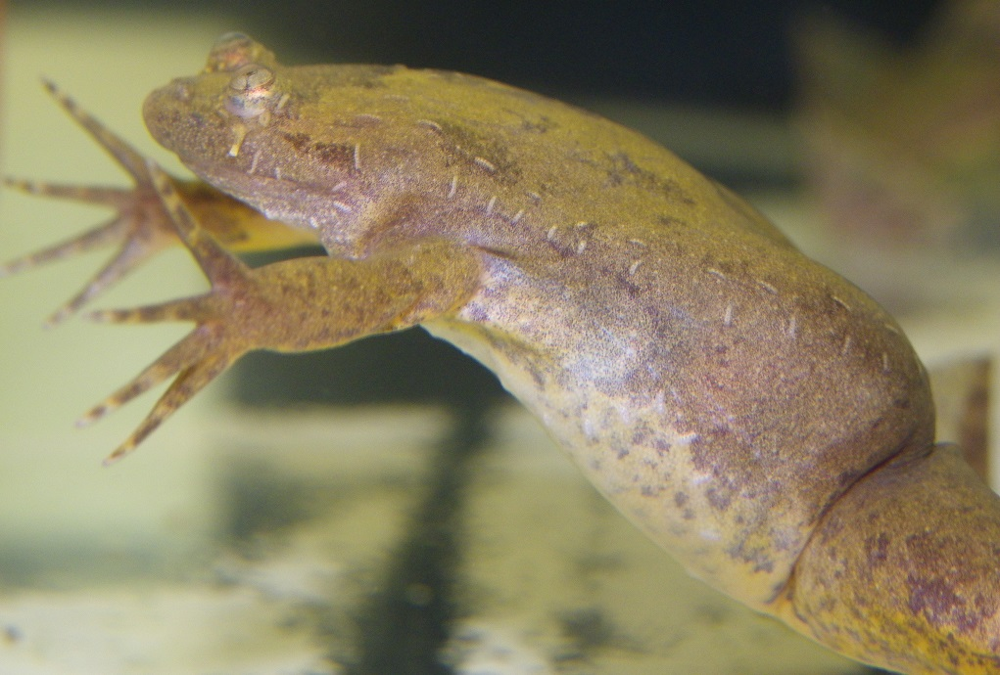

.. xenopus-supplement documentation master file, created by
   sphinx-quickstart on Wed Apr 10 20:55:25 2019.
   You can adapt this file completely to your liking, but it should at least
   contain the root `toctree` directive.

   
Supplement for *Xenopus tropicalis*
===================================

This is the supplement for the paper entitled "A modular approach
reveals composite markers of mobility and dispersal in the western
clawed frog *Xenopus tropicalis*".  The analysis of high-throughput
sequencing data can involve pipelines of many types, where in addition
many of the individual pipeline components can be carried out with
more than one method, software tool or set of parameters.  Here we
present the details so that the results may be reproduced.  The
pipeline was carried out on three assemblies of the *X. tropicalis*
endurance transcriptome at both the gene and isoform levels.
Additional supporting materials for the manuscript are also included.

Results by assembly method
________________________________

.. toctree::
   :maxdepth: 1
   :caption: Contents:
	     
   Trinity de novo assembly  <de-novo/de-novo>
   Trinity genome-guided assembly <genome-guided/genome-guided>
   references
      
Indices and tables
==================

* :ref:`genindex`
* :ref:`modindex`
* :ref:`search`
