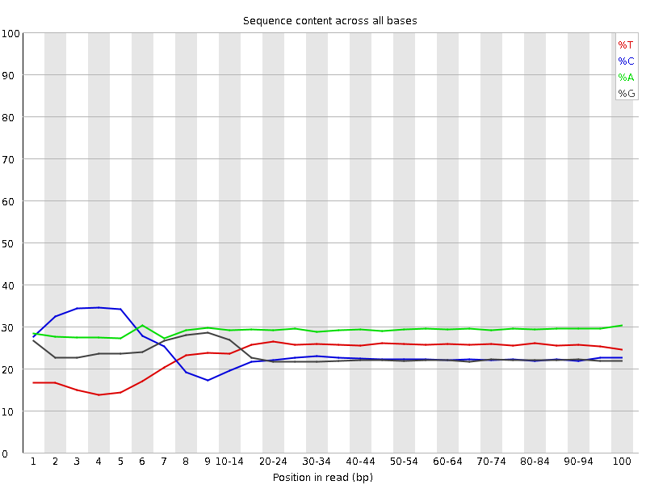
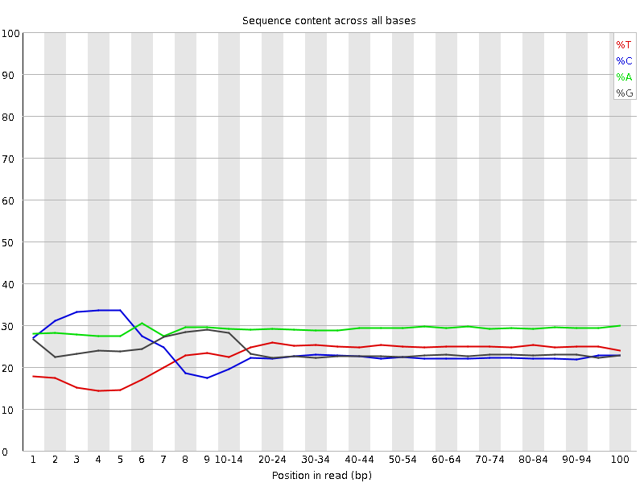
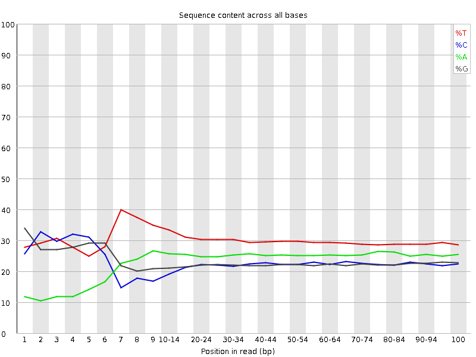
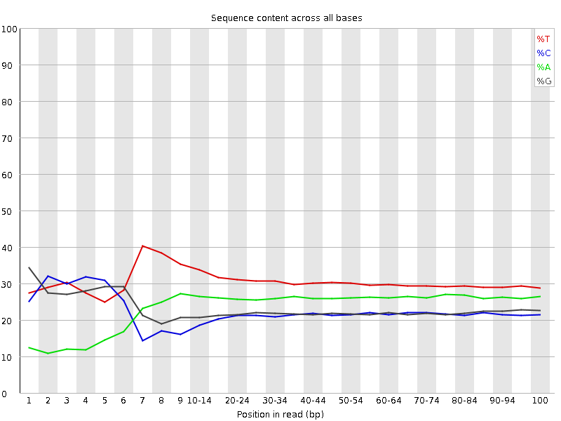
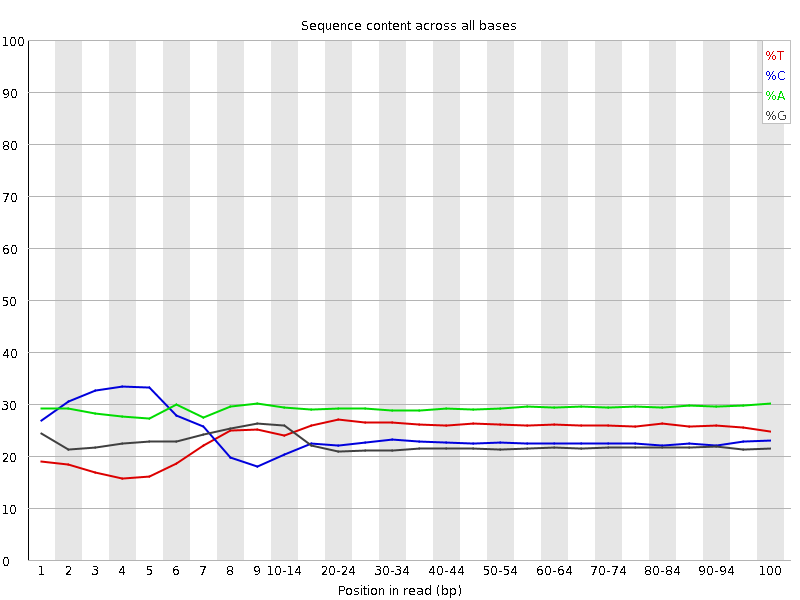

.. xenopus project

Base distribution overview
============================

The following plots indicate per base sequence content for each sample. In general for standard genomic and transcriptomic experiments one expects to see an even distribution of bases across reads. Significant deviations are likely indicative low-diversity libraries which cause problems for Illumina-based sequencing. Such low diversity sequences may be indicative of sample or library issues. 

Sample A
__________

.. INCLUDE A_R1_per_base_sequence_content.png, A_R2_per_base_sequence_content.png

.. image:: A_R2_per_base_sequence_content.png
   :width: 30%

Sample B
__________

.. INCLUDE B_R1_per_base_sequence_content.png, B_R2_per_base_sequence_content.png

.. image:: B_R2_per_base_sequence_content.png
   :width: 30%

Sample C
__________

.. INCLUDE C_R1_per_base_sequence_content.png, C_R2_per_base_sequence_content.png

Sample D
__________

.. INCLUDE D_R1_per_base_sequence_content.png, D_R2_per_base_sequence_content.png

.. image:: D_R1_per_base_sequence_content.png
   :width: 30%

.. image:: D_R2_per_base_sequence_content.png
   :width: 30%

Sample E
__________

.. INCLUDE E_R1_per_base_sequence_content.png, E_R2_per_base_sequence_content.png

.. image:: E_R1_per_base_sequence_content.png
   :width: 30%

Sample F
__________

.. INCLUDE F_R1_per_base_sequence_content.png, F_R2_per_base_sequence_content.png

.. image:: F_R1_per_base_sequence_content.png
   :width: 30%

.. image:: F_R2_per_base_sequence_content.png
   :width: 30%

Sample G
__________

.. INCLUDE G_R1_per_base_sequence_content.png, G_R2_per_base_sequence_content.png

.. image:: G_R1_per_base_sequence_content.png
   :width: 30%

.. image:: G_R2_per_base_sequence_content.png
   :width: 30%

Sample H
__________

.. INCLUDE H_R1_per_base_sequence_content.png, H_R2_per_base_sequence_content.png

