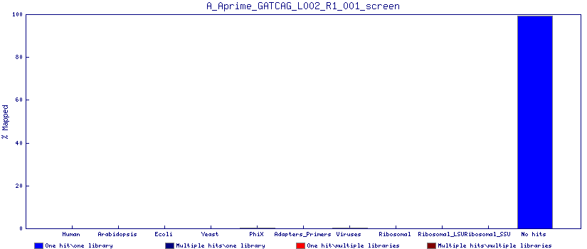
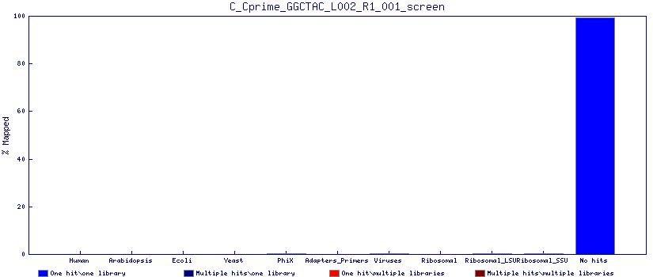
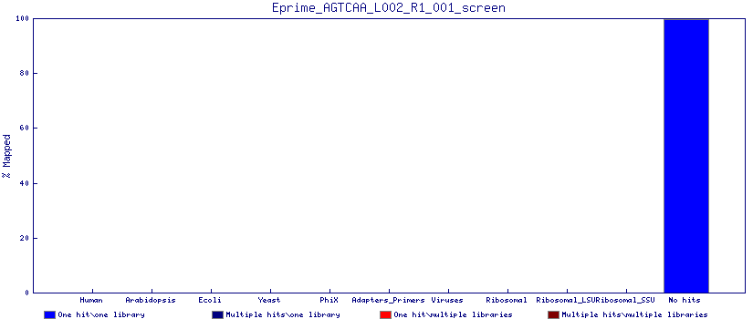

.. xenopus project

Contaminant check
=======================

The following plots indicate the proportion of reads mapping to each of the categories listed. Unless a sample is closely related to one of the categories, you should not expect to see significant numbers of reads mapping to any of these categories.  For transcriptomics experiments, signficant rRNA may be present if rRNA depletion was performed or if there is evidence of RNA degredation during Bioanalyser checks.  Significant quantities of adaptor sequence are indicative of short fragment sizes or issues relating to DNA quantification.

Sample A
____________

.. INCLUDE A_R1_contaminant_screen.png

Sample B
____________

.. INCLUDE B_R1_contaminant_screen.png

Sample C
____________

.. INCLUDE C_R1_contaminant_screen.png

Sample D
____________

.. INCLUDE D_R1_contaminant_screen.png

Sample E
____________

.. INCLUDE E_R1_contaminant_screen.png

Sample F
____________

.. INCLUDE F_R1_contaminant_screen.png

.. image:: F_R1_contaminant_screen.png
   :width: 50%

Sample G
____________

.. INCLUDE G_R1_contaminant_screen.png

Sample H
____________

.. INCLUDE H_R1_contaminant_screen.png

